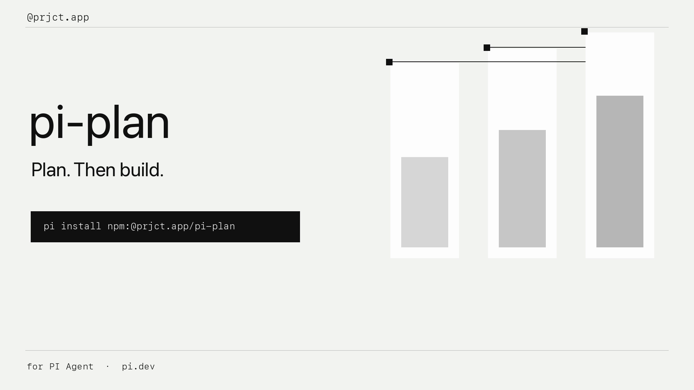

# pi-plan

[](https://pi.dev)

Plan before editing in PI Agent with read-only tool restrictions, an approval step, and task progress tracking.

`@prjct.app/pi-plan` · Planning commands and progress UI; one extension.

## Demo

[](https://github.com/prjct-app/pi-plan/raw/refs/heads/main/media/pi-plan-demo/pi-plan-demo.mp4)

[Watch or download the 40-second demo](https://github.com/prjct-app/pi-plan/raw/refs/heads/main/media/pi-plan-demo/pi-plan-demo.mp4). It shows read-only exploration, structured planning, human review, and tracked execution in PI Agent. The film follows the package's monochrome cover identity and uses an original instrumental soundtrack with no voice-over or external samples.

## Install

Requires Pi installed separately and Node.js **22.19 or later**. Compatibility is tested with **Pi 0.85.1**; newer versions are not yet verified. This is an independent community package.

Install with Pi's package manager:

```sh
pi install npm:@prjct.app/pi-plan
```

For project-only installation, add `-l`: `pi install -l npm:@prjct.app/pi-plan`. Restart Pi after installation. Do not install the same extension from both GitHub and npm: Pi treats those as different package identities.

## Usage

| Entry point | Behavior |
| --- | --- |
| `/plan` | Toggle planning mode |
| `Ctrl+Alt+P` | Toggle planning mode from the keyboard |
| `/todos` | Open the current plan dialog with steps, progress, and verification |
| `pi --plan` | Start with planning enabled after the extension is installed |

Run `/plan`, then ask Pi to investigate a concrete task. The planner answers with a **Goal**, a short **Approach**, numbered steps under a `Plan:` heading that reference real files, a **Verify** section with the exact validation commands, and any **Risks**.

When a plan is ready, a review dialog offers four actions:

- **Execute the plan** — restore full tools and track step progress.
- **Refine the plan** — send feedback and keep planning.
- **Stay in plan mode** — keep read-only exploration.
- **Discard the plan** — exit plan mode and drop the steps.

During execution, a progress widget shows a completion bar, the current step, and the Verify command; `[DONE:n]` markers update completed steps, the footer shows `▸ plan n/total`, and the transcript renders the plan, kickoff, and completion with collapsed summaries expandable via `Ctrl+O`. After the final step, Pi runs the Verify commands and reports the result.

Planning disables the managed `edit` and `write` tools and checks Bash calls against a read-only allowlist. Other custom tools and external processes can retain write capabilities. Plan mode is a workflow policy, not a security sandbox.

Install Pi Workflows separately if you also want `/work`, `/spec`, and the other workflow commands. Pi Plan works independently. Its integration event remains `plan-mode:enable` and its status key remains `plan-mode`, preserving compatibility with existing integrations.


## Manage the package

For an npm installation:

```sh
pi list
pi update npm:@prjct.app/pi-plan
pi remove npm:@prjct.app/pi-plan
```

Use `pi config` to enable or disable individual resources. Use `pi config -l` for project settings and add `-l` to removal when you installed locally.

To pin version 0.2.0, use `pi install npm:@prjct.app/pi-plan@0.2.0`. Pi skips pinned npm versions during package updates. For a Git installation, update or remove using the same `git:github.com/prjct-app/pi-plan` source instead of the npm source.

When switching from GitHub to npm, remove the Git installation first, then install the npm package and restart Pi.

## Troubleshooting

If `/work` is unknown, install Pi Workflows too. If `/todos` is empty, ask for numbered steps under a `Plan:` heading. Restart after installation so the extension and CLI flag are registered.

## Package and API documentation

Uses documented tool selection, `tool_call`, commands, shortcuts, flags, `appendEntry()`, `pi.events`, status/widget APIs, custom message and entry renderers, and documented TUI components (`SelectList`, `DynamicBorder`, `Text`, `Container`). Plan progress records are display-only entries that never enter the model context; only the execution kickoff instruction does.

See [Package structure and compatibility](docs/package.md) for the manifest, dependency policy, shipped resources, and official references. This package follows the [official Pi package guide](https://github.com/earendil-works/pi/blob/v0.85.1/packages/coding-agent/docs/packages.md) and [extension API guide](https://github.com/earendil-works/pi/blob/v0.85.1/packages/coding-agent/docs/extensions.md) for the tested version.

## Development

From a repository checkout:

```sh
npm ci --ignore-scripts
npm run check
npm test
npm run check:package
```

Pi loads the TypeScript entry point directly; no build step is required. To try this checkout for one run, use `pi -e .`. Tests use isolated temporary state and do not call model APIs. See [CONTRIBUTING.md](CONTRIBUTING.md) for contribution rules, [Automatic releases](docs/releases.md) for publishing, and [CHANGELOG.md](CHANGELOG.md) for release notes.

## License

[MIT](LICENSE).

Third-party code or assets are credited in [THIRD_PARTY_NOTICES.md](THIRD_PARTY_NOTICES.md); the accompanying licenses are included.
